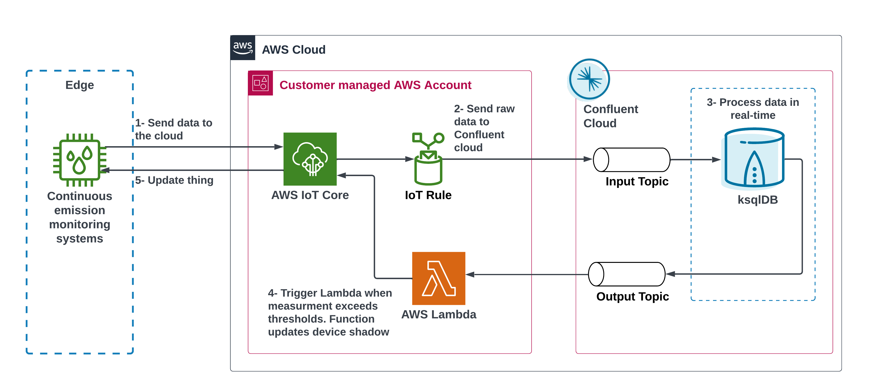

#  Real-time monitoring and remediation of IoT Devices using Confluent, AWS IoT Core and AWS Lambda

This repository accompanies the [Real-time monitoring and remediation of IoT Devices using Confluent, AWS IoT Core and AWS Lambda](https://aws.amazon.com/blogs) blog post. It contains the necessary Terraform scripts to deploy the solution. 

The sample solutiion demonstrated how to [Confluent Cloud](https://www.confluent.io/confluent-cloud/) and [AWS IoT Core](https://aws.amazon.com/iot-core/)  to monitor emissions and automate responses using Confluent's [AWS Lambda](https://aws.amazon.com/lambda/) Integration. In this fictional scenario, you are working at a plant that wants to lower its emissions levels. To do this, you will deploy the following:
1. Air emissions monitoring system - This will gather concentration levels for Carbon Dioxide (CO2) and Nitrogen Oxide (NOx)
2. Real-time processing pipeline - This will route data to the appropriate destinations and perform transformations to the data needed for downstream systems
3. Automated Response - This will be triggered when NOx levels trend beyond a set bound. When triggered, ammonia will be injected into the plant's boiler system which will lower the level of NOx.

With all three of these things, you will be able to detect and lower NOx levels in under 10ms.

<br>




```bash
├── assets                                <-- Directory that will hold solution diagrams
│   ├── architecture.png                  <-- Architecture of this sample solution
├── Terraform                             <-- Directory that will hold Terrafom Scripts and Solution Artifacts
│   ├── chaos_lambda.py                   <-- Lambda function code to simulate out of bounds NOx readings
│   ├──fix_lambda.py                      <-- Lambda function code to automate NOx level adjustments
│   ├──aws.tf                             <-- Terraform script to deploy AWS resources
│   ├──main.tf                            <-- Terraform script to deploy Confluent resources
│   ├──outputs.tf                         <-- Terraform file for solution outputs
│   ├──providors.tf                       <-- Terraform providors file
│   ├──terraform.tfvars                   <-- Variables file
│   ├──variables.tf                       <-- Variables definition                       
└── README.md
```


## General Requirements
1. Terraform [installed](https://developer.hashicorp.com/terraform/tutorials/aws-get-started/install-cli)
2. AWS Access keys (create these before starting the setup) with permissions to AWS IoT, AWS Lambda, AWS Secrets Manager, and IAM
3. AWS CLI installed and configured with access keys.
4.Confluent Cloud account with [Cloud API Keys](https://docs.confluent.io/cloud/current/access-management/authenticate/api-keys/api-keys.html#cloud-cloud-api-keys)
5. Install Python 3.8.2 or later and have the following python libraries installed: `awsiotsdk` and `awscrt`
6. Workshop Time: ~ 45 min


## Deploy solution

1. Clone the repo onto your local development machine using `git clone <repo url>`.
2. Change directory to solution repository.

```
cd Confluent-AWS-IoT-Core-Emissions-Solution

```

3. Edit the variables in terraform.tfvars files
    * region = AWS Region to deploy the solion in
    * vpc_cidr = AWS VPC IP CIDR
    * confluent_topic_name - Confluent Cloud topic that will hold NOx level readings
    * confluent_cloud_api_key - Confluent Cloud API Key created in [General Requirements](#general-requirements)
    * confluent_cloud_api_secret -  Confluent Cloud API secret created in [General Requirements](#general-requirements)
4. Run ```terraform -chdir="./terraform" init```
5. Run ```terraform -chdir="./terraform" apply```


### Post Deployment Steps

The following will finish the build out of the real-time processing pipeline. In ksqlDB you will create streams that take the average NOx levels of the past 10 most recent records. The connector will be how Confluent Cloud triggers the AWS Lambda, injects ammonia into the boiler system, and lowers NOx levels.

#### ksqlDB
1. Log into [Confluent Cloud](https://www.confluent.cloud)
2. Choose the new environemt, cluster and ksqlDB cluster
3. In the query editor, create a ksqlDB stream based off the topic created in a previous section. This allows ksqlDB to process and transform the data. Paste the following into the query box:
    ```
    CREATE STREAM air_quality (device_id int, co_concentration double, nox_concentration double) WITH (
        kafka_topic = '<confluent_topic_name>',
        value_format = 'json',
    KEY_FORMAT='JSON'
    );
    ```

4. Create a ksqlDB table that holds the latest average of the 10 most recent NOx level readings. Paste the following into the query box:
    ```
    CREATE TABLE NOX_LATEST_AVERAGE
    WITH (KAFKA_TOPIC='IOT_DEMO_NOX_LATEST_AVERAGE') 
    AS
    SELECT DEVICE_ID,
        LATEST_BY_OFFSET(nox_concentration) AS nox_concentration_RECENT,
        AVG(nox_concentration) AS NOX_AVERAGE
    FROM  AIR_QUALITY 
        WINDOW HOPPING (SIZE 1 MINUTES, ADVANCE BY 1 MINUTE)
    GROUP BY DEVICE_ID
    HAVING   AVG(nox_concentration) > 3;
    ```
    
### Lambda Sink Connector
1. Log into [Confluent Cloud](https://www.confluent.cloud)
2. Choose the new environemt and cluster
2. Click "Connectors"
3. Click "Add Connector" and find "AWS Lambda Sink"
4. Select the topic that has the following format: `IOT_DEMO_NOX_LATEST_AVERAGE`
5. The rest of the values are as follows:

    | Field      | Value |
    | ----------- | ----------- |
    | Name      | LambdaSink       |
    | Input Message Format   | JSON        |
    |  Kafka API Key      | (API Key created in previous section)      |
    | Kafka API Secret    | (API Secret created in previous section)         |
    |  AWS API Key ID     | (Your AWS API Key ID)      |
    | AWS API Secret Access Key   | (Your AWS API Secret Access Key)         |
    | AWS Lambda Innvocation Type      | async       |
    | AWS Lambda function name      | air-quality-fix-simulation-(the environment value you provided in the Cloudformation)       |
    | Tasks      | 1       |
    
## Run the demo  
    
### Local Setup
Create your air emissions monitoring system. This will create a Thing in IoT Core, create and download the appropriate certs, and attach the Thing policy. Your computer will serve as the on-prem emissions monitoring system and create/send simulated data to IoT Core.
1. Ensure you have the proper python libraries installed by running the following:
```
python3 -m pip install awsiotsdk
python3 -m pip install awscrt 
```
1. Run `./assembly-line-setup.sh 1 air-quality-system `


### Start your monitoring system
1. Get your AWS ATS by running the following (requires AWS CLI):


    `aws iot describe-endpoint --endpoint-type iot:Data-ATS`
    
    Make note of the returned value.
2. In your terminal, navigate to the following directory:

    ```cd assembly-line-1/air-quality-system```
2. Start the air monitoring system with the following command (insert the endpoint value you recieved a couple steps before):
    
    `python3 air-quality-sensor.py  --endpoint <xxxxxxxx-ats.iot.us-west-2.amazonaws.com> --line 1 `


3. Watch the output for the (a) the initial connections of your device to IoT Core,(b) the shadow creation and setting of your Thing, and (c) the simulated data of emissions levels being set to IoT Core. 

### Simulate out of bounds values
1. Simulate out of bounds values by going to the Lambda service page and selecting the Lambda prefixed `air-quality-chaos-simulation`. 

2. Create a new event with the following code:
    ```
    {
    "value": "2"
    }
    ```

3. Click `Test`. This will update the ammonia values on the emissions monitoring system to a low value. In turn, you will see NOx concentration upwards in the terminal where you have your thing output. At a certain point, your ksqlDB will trigger a different Lambda function that will set the ammonia levels to its proper value. You will then see the NOx concentration values trend downwards once again.


## License
This library is licensed under the MIT-0 License. See the LICENSE file.


